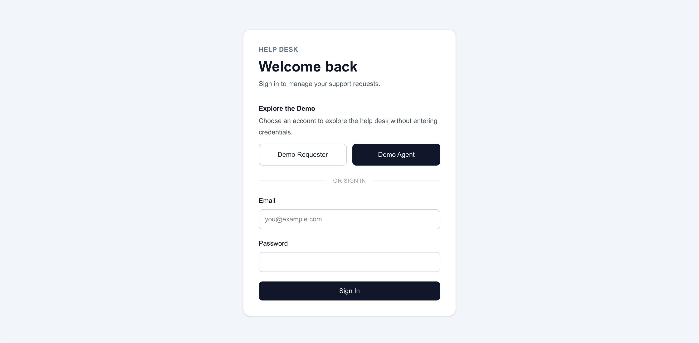
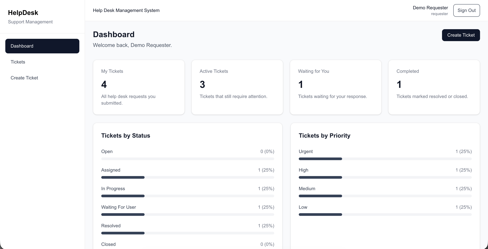
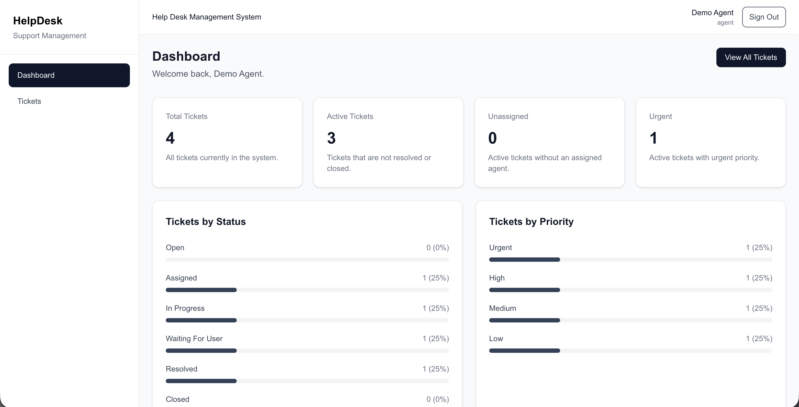
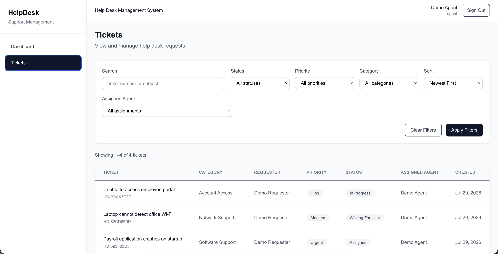
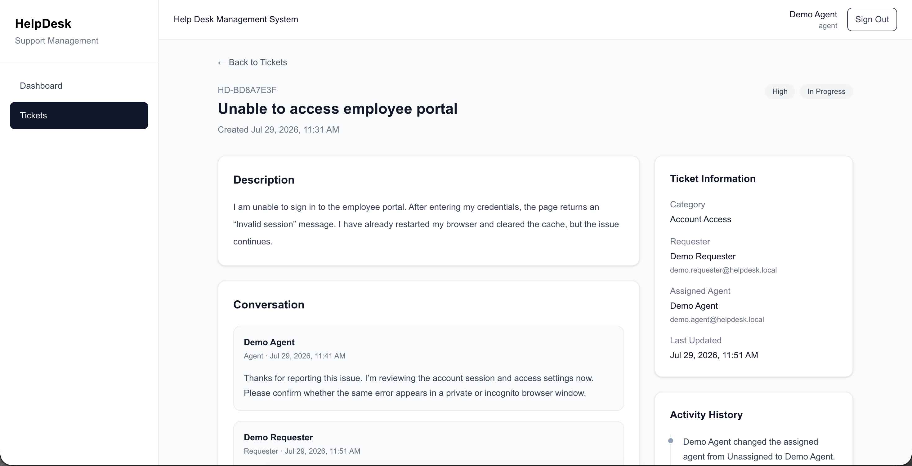
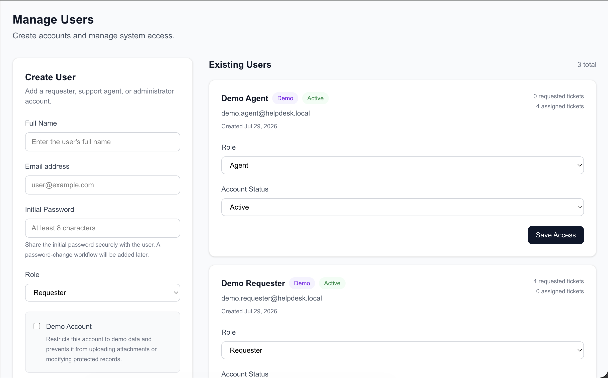
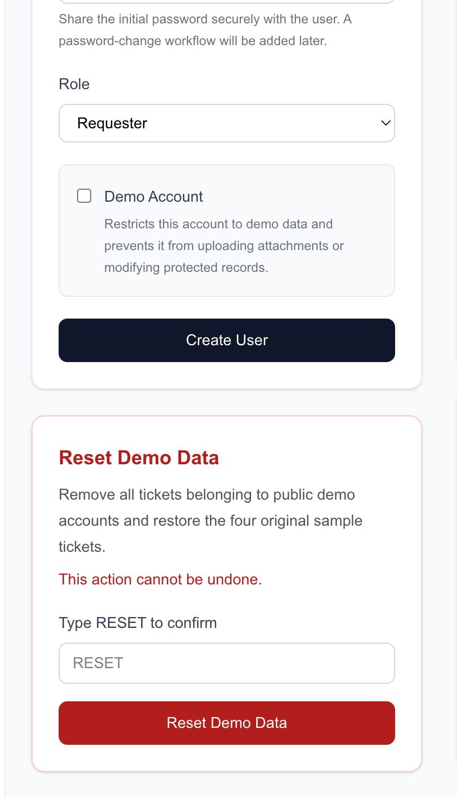
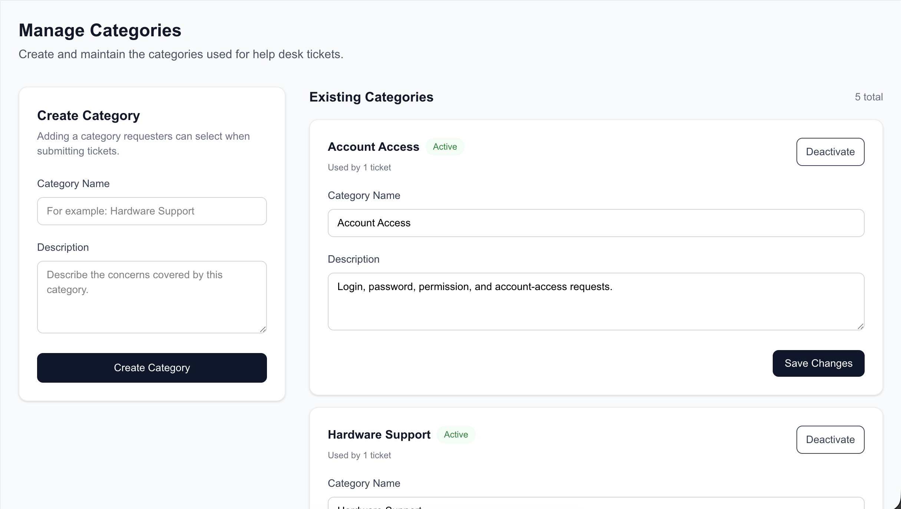

# Help Desk Management System

A full-stack help desk application for managing support requests, assigning agents, tracking ticket progress, and maintaining communication between requesters and support staff.

The project includes role-based access control, ticket workflows, comments, activity history, secure file attachments, administrative tools, and public demo accounts designed for portfolio visitors.

## Live Demo

**Production:** https://helpdesk-ivanlo.vercel.app

The login page includes one-click access for:

- **Demo Requester** — create tickets, view personal requests, and communicate with support agents
- **Demo Agent** — manage demo tickets, update statuses and priorities, assign requests, and respond to requesters

Demo credentials are handled securely through server-side environment variables and are not exposed in the browser.

## Features

### Authentication and Access Control

- Secure credentials-based authentication using Auth.js
- Password hashing with bcrypt
- Role-based authorization
- Protected application routes
- Active and inactive user-account states
- Protection against removing the final active administrator
- Protection against administrators deactivating or demoting their own accounts

### Requester Features

Requesters can:

- Create support tickets
- Select a category and priority
- View only their authorized tickets
- Track ticket status and assigned agent
- Reply to support agents
- View public ticket activity
- Download authorized attachments
- View dashboard summaries for active, waiting, and completed tickets

### Agent Features

Agents can:

- View authorized support tickets
- Assign tickets to themselves or another agent
- Change ticket status and priority
- Add public replies
- Add internal notes hidden from requesters
- Review ticket activity history
- Download authorized attachments
- Track assigned, active, urgent, and unresolved tickets

### Administrator Features

Administrators can:

- Access all authorized tickets
- Create and manage user accounts
- Assign Requester, Agent, or Administrator roles
- Activate or deactivate user accounts
- Create and manage ticket categories
- Mark accounts as public demo accounts
- View Demo and Active account labels
- Reset public demo data to its original sample state
- Access administrative dashboard information

## User Roles

The system supports three roles:

| Role | Description |
|---|---|
| Requester | Creates support requests and communicates with support staff |
| Agent | Processes, assigns, updates, and responds to tickets |
| Administrator | Manages the entire system, including users and categories |

## Ticket Workflow

Tickets support the following statuses:

| Status | Description |
|---|---|
| Open | Newly submitted and awaiting review |
| Assigned | Assigned to a support agent |
| In Progress | Currently being investigated or processed |
| Waiting for User | Requires additional information from the requester |
| Resolved | The reported issue has been resolved |
| Closed | The ticket workflow has been completed |

## Ticket Priorities

| Priority | Intended Use |
|---|---|
| Low | Minor issues with little operational impact |
| Medium | Standard support requests |
| High | Important issues requiring timely attention |
| Urgent | Critical issues requiring immediate action |

## Ticket Categories

The deployed demo includes categories such as:

- Account Access
- Hardware Support
- Network Support
- Software Support
- Technical Support
- General Inquiry

Administrators can create, update, activate, and deactivate categories.

## Comments and Activity History

Each ticket includes:

- A chronological conversation between requesters and support staff
- Internal agent notes that are hidden from requesters
- Assignment-change history
- Status-change history
- Priority-change history
- Ticket creation records
- Timestamps and responsible users for recorded activities

## Secure Attachments

The application supports private ticket attachments using Vercel Blob.

Supported file types:

- JPEG
- PNG
- WebP
- PDF

Attachment protections include:

- Maximum file size validation
- Server-side file-type validation
- Private Blob storage
- Authentication checks before downloads
- Ticket-level authorization
- Automatic cleanup when a database write fails
- Restricted uploads for public demo accounts
- Hidden upload controls for demo users

Unauthorized attachment requests return an error without exposing private ticket information.

## Public Demo Protection

Public demo accounts remain interactive. Visitors can create tickets, add replies, and manage demo workflows according to their assigned roles.

Additional restrictions protect the system:

- Demo users cannot upload attachments
- Demo users cannot access private or non-demo tickets
- Demo users cannot reset shared demo data
- Demo tickets are isolated from normal user tickets
- Only a non-demo administrator can reset the sample data

The **Reset Demo Data** feature removes visitor-created demo tickets and restores four predefined sample tickets with different priorities, statuses, assignments, comments, and activity records.

## Technology Stack

### Frontend

- Next.js 16
- React 19
- TypeScript
- Tailwind CSS 4
- React Server Components
- Server Actions

### Backend

- Next.js App Router
- Auth.js / NextAuth
- Prisma ORM 7
- PostgreSQL
- Prisma Postgres
- Zod validation
- bcrypt password hashing

### Storage and Deployment

- Vercel
- Vercel Blob
- Prisma Postgres
- GitHub

## Database Models

The main database models are:

- `User`
- `Category`
- `Ticket`
- `TicketComment`
- `TicketActivity`
- `TicketAttachment`

Important relationships include:

- A requester can create multiple tickets
- An agent can be assigned multiple tickets
- A ticket belongs to one category
- A ticket can contain multiple comments, activities, and attachments
- Ticket comments, activities, and attachment records are removed when their ticket is deleted

## Local Development

### Prerequisites

Install the following:

- Node.js
- npm
- PostgreSQL or a Prisma Postgres database
- Git

### Installation

Clone the repository:

```bash
git clone https://github.com/ivanjameslo/help-desk-management.git
cd help-desk-management
```

Install dependencies:

```bash
npm install
```

Create a `.env.local` file in the project root:

```env
DATABASE_URL="your-postgresql-connection-string"

AUTH_SECRET="your-local-auth-secret"

BLOB_READ_WRITE_TOKEN="your-vercel-blob-token"

DEMO_AGENT_EMAIL="demo.agent@helpdesk.local"
DEMO_AGENT_PASSWORD="your-local-demo-agent-password"

DEMO_REQUESTER_EMAIL="demo.requester@helpdesk.local"
DEMO_REQUESTER_PASSWORD="your-local-demo-requester-password"
```

Generate a secure local authentication secret:

```bash
openssl rand -base64 33
```

Never commit `.env`, `.env.local`, database connection strings, passwords, authentication secrets, or Blob tokens.

### Generate the Prisma Client

```bash
npx prisma generate
```

### Apply Database Migrations

For local development:

```bash
npx prisma migrate dev
```

For an existing production database:

```bash
npx prisma migrate deploy
```

### Optional Local Seed

The repository includes a Prisma seed file:

```bash
npx tsx prisma/seed.ts
```

Review and update the seed accounts and passwords before using them outside local development.

### Start the Development Server

```bash
npm run dev
```

Open:

```text
http://localhost:3000
```

## Available Scripts

```bash
npm run dev
```

Starts the local development server.

```bash
npm run build
```

Creates a production build.

```bash
npm run start
```

Runs the compiled production application.

```bash
npm run lint
```

Runs ESLint.

```bash
npx prisma generate
```

Regenerates the Prisma client.

```bash
npx prisma migrate dev
```

Creates and applies local database migrations.

```bash
npx prisma migrate deploy
```

Applies pending migrations to a production database.

## Environment Separation

Local development and Vercel production use separate environment variables.

For example:

- `.env.local` provides the local `AUTH_SECRET`
- Vercel Environment Variables provide the production `AUTH_SECRET`
- Local and production authentication sessions are independent
- Changing a secret invalidates sessions created with the previous secret
- Database users and password hashes are not changed when `AUTH_SECRET` changes

Production secrets should be stored as Sensitive environment variables in Vercel.

## Security Decisions

The project implements several security measures:

- Passwords are hashed with bcrypt
- Authentication secrets remain server-side
- Demo passwords remain server-side
- Server Actions verify the current user and role
- Zod validates form submissions
- Database queries enforce ticket-level authorization
- Attachments are stored privately
- Attachment downloads require authentication and authorization
- Demo accounts are isolated using `isDemo`
- Administrators cannot remove the system’s final active administrator
- Demo-data resets require the exact confirmation text `RESET`
- Environment files are excluded from version control

## Production Validation

The production deployment has been tested for:

- Administrator login
- Demo Requester one-click login
- Demo Agent one-click login
- Role-based dashboards
- Ticket creation
- Assignment and status changes
- Requester and agent replies
- Waiting-for-user workflow
- Resolved-ticket workflow
- Attachment upload restrictions
- Authorized attachment downloads
- Unauthorized attachment access
- Signed-out attachment access
- Demo-data reset
- Production database migrations

## Screenshots

### Login Page



### Requester Dashboard



### Agent Dashboard



### Ticket Details




### Manage Users




### Manage Users




## Future Improvements

Potential future additions include:

- Password-change and password-reset workflows
- Email notifications
- Service-level agreement tracking
- Advanced reporting and analytics
- Ticket search and pagination
- Knowledge-base articles
- Automated ticket assignment
- User profile settings
- Audit-log administration
- Automated unit and integration testing

## Project Purpose

This project was developed to strengthen full-stack development skills, particularly in:

- Backend development
- Database design
- Authentication and authorization
- Secure file handling
- Server-side validation
- Production database migrations
- Deployment and environment management
- Building portfolio-ready public demos

## License

This project is intended for educational and portfolio purposes.